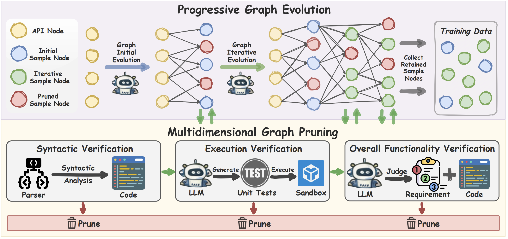

# PriCoder

This repo provide a full pipeline for **private-library-oriented code generation**: inference/evaluation, and training-data synthesis for teaching models to truly use private libraries effectively.

---

## 🧭 Repository Map

- `api_extract/` — API-doc extraction and filtering
- `data_generation/` — PriCoder training-data synthesis pipeline
- `infer_and_eval/` — inference and evaluation
- `data/` — reusable assets (documents and benchmarks)
- `pypi_crawling/` — auxiliary package mining/filtering tools

---

## 🚀 Quick Workflow

1. Extract API docs from a target private library
2. Synthesize PriCoder training data and fine-tune
3. Run model inference and execution-based evaluation

**Detailed commands are in each subdirectory README.**
